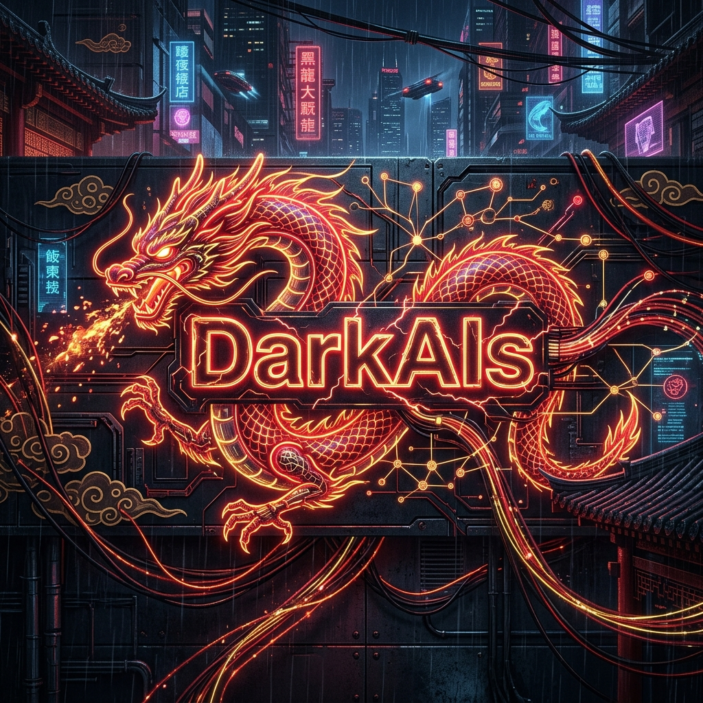

<div align="center">



# 🐉 The Chinese Open-Source AI Renaissance
**The Definitive Architectural Guide to the Eastern Models Beating Llama-3**

[](https://opensource.org/licenses/MIT)
[](https://GitHub.com/karidasd/Chinese-OpenSource-AI/graphs/commit-activity)

*A masterclass technical breakdown of the Eastern AI ecosystem. Exploring why models from Alibaba, DeepSeek, and 01.AI are dominating global benchmarks, how their architectures fundamentally reduce inference costs, and how to deploy them locally.*

</div>

---

## 🛑 The Paradigm Shift

For years, the Open-Source AI narrative was dominated by Silicon Valley (Meta's Llama, Mistral, Databricks). In 2024, the paradigm violently shifted East. Chinese open-weights models are currently achieving State-of-the-Art (SOTA) performance across global benchmarks, frequently surpassing proprietary models like GPT-4o and Claude 3.5 Sonnet in coding, mathematics, and long-context retrieval, while operating at a fraction of the parameter cost.

This repository serves as a Senior Architect's guide to understanding, deploying, and leveraging these models in production environments.

---

## 🏛️ The "Four Dragons" (Leading Ecosystems)

### 1. Alibaba Cloud (Qwen)
The **Qwen-2** series is widely considered the undisputed king of Open-Source LLMs as of mid-2024.
- 🔗 **Official Links:** [HuggingFace](https://huggingface.co/Qwen) | [GitHub Repository](https://github.com/QwenLM/Qwen2) | [Technical Report](https://arxiv.org/abs/2407.10671)
- **Strengths:** Peerless multilingual capabilities (29 languages natively supported) and exceptional coding proficiency (surpassing Llama-3 70B).
- **Architecture:** Dense transformer architecture utilizing SwiGLU activation, dual-chunk RoPE (Rotary Position Embedding) for context scaling up to 128K, and Grouped-Query Attention (GQA).

### 2. DeepSeek (DeepSeek-V2 & DeepSeek-Coder)
DeepSeek shocked the industry by training a 236B parameter MoE model that costs incredibly little to train and serve.
- 🔗 **Official Links:** [HuggingFace](https://huggingface.co/deepseek-ai) | [GitHub Repository](https://github.com/deepseek-ai/DeepSeek-V2) | [DeepSeek-V2 Paper](https://arxiv.org/abs/2405.04434)
- **Strengths:** Coding, Math, and unbelievable API cost-efficiency.
- **Architecture (The Secret Sauce):** 
  - **MLA (Multi-Head Latent Attention):** They compressed the KV Cache into a latent vector, reducing memory overhead during inference by 90% compared to standard MHA. This makes serving massive models incredibly cheap.
  - **DeepSeekMoE:** Advanced sparse routing. Out of 236B parameters, only 21B are active during a forward pass.

### 3. 01.AI (Yi Series)
Founded by Kai-Fu Lee, the **Yi-1.5** series focuses on massive context windows and pristine data quality.
- 🔗 **Official Links:** [HuggingFace](https://huggingface.co/01-ai) | [GitHub Repository](https://github.com/01-ai/Yi-1.5) | [Technical Report](https://arxiv.org/abs/2403.04652)
- **Strengths:** 200K+ context windows with near-perfect needle-in-a-haystack retrieval. Extremely high quality pre-training data resulting in powerful reasoning in smaller 34B form factors.

### 4. Zhipu AI (GLM-4)
The General Language Model (GLM) series is a powerhouse originating from Tsinghua University.
- 🔗 **Official Links:** [HuggingFace](https://huggingface.co/THUDM) | [GitHub Repository](https://github.com/THUDM/GLM-4) | [GLM-4 Release](https://chatglm.cn/blog)
- **Strengths:** GLM-4 is highly optimized for complex instruction following, multi-turn dialogue, and tool-use (Function Calling/Agentic Workflows).

---

## 👁️ The Rise of Eastern Vision-Language Models (VLMs)
Beyond text, Chinese models are currently crushing the Vision leaderboards, particularly in OCR (Optical Character Recognition) and complex document parsing.
- **Qwen-VL-Max:** Frequently outperforms GPT-4V in reading dense tables, charts, and mathematical equations from images.
- **DeepSeek-VL:** Designed with an extreme focus on high-resolution image understanding without hallucinating text.
- **GLM-4V:** Exceptional at grounding visual information to tool-use, allowing agents to execute GUI actions based on screenshots.

---

## 📊 Benchmarks vs The West

| Model | Parameters (Active) | Context Length | MMLU | HumanEval (Code) | GSM8K (Math) |
| :--- | :---: | :---: | :---: | :---: | :---: |
| **Qwen2-72B-Instruct** | 72B | 128K | **84.2** | **86.0** | **91.1** |
| **Llama-3-70B-Instruct** | 70B | 8K | 82.0 | 81.7 | 93.0 |
| **DeepSeek-V2** | 21B | 128K | 78.5 | 81.1 | 88.2 |
| **Mistral Large** | Dense | 32K | 81.2 | 81.0 | 91.2 |

---

## 💻 Developer Resources

### 1. Hardware Requirements (VRAM Vitals)
Deploying these models requires precise memory management. Below is the minimum VRAM required to load the model (excluding KV Cache for context).

| Model Size | Full Precision (FP16/BF16) | 8-bit Quantization (AWQ/GPTQ) | 4-bit Quantization (GGUF/AWQ) | Recommended GPU Setup |
| :--- | :--- | :--- | :--- | :--- |
| **7B - 9B** (Qwen/GLM) | ~14 - 18 GB | ~7 - 9 GB | ~4 - 6 GB | 1x RTX 3090 / 4090 |
| **34B** (Yi-1.5) | ~68 GB | ~34 GB | ~18 GB | 1x RTX 4090 (4-bit) or 2x 3090 |
| **72B** (Qwen2) | ~144 GB | ~72 GB | ~38 GB | 2x RTX 3090 (4-bit) or 2x A6000 |
| **236B MoE** (DeepSeek) | ~472 GB | ~236 GB | ~120 GB | 2x H100 (8-bit) or 8x A100 |

### 2. Prompt Formatting & Chat Templates
Failing to use the correct Chat Template will cause severe hallucinations. Most Chinese models use the **ChatML** format (unlike Llama-3's `<|start_header_id|>`).

**Qwen2 / Yi ChatML Format:**
```text
<|im_start|>system
You are a Principal AI Engineer.<|im_end|>
<|im_start|>user
Write a quicksort in Python.<|im_end|>
<|im_start|>assistant
```

### 3. The Fine-Tuning Stack
The definitive tool for fine-tuning these models is **LLaMA-Factory** (also developed by Chinese researchers). It natively supports Qwen, DeepSeek, and Yi out of the box.
- 🔗 **[LLaMA-Factory GitHub](https://github.com/hiyouga/LLaMA-Factory)**
- Use it to perform memory-efficient **QLoRA** (Quantized Low-Rank Adaptation) fine-tuning on consumer GPUs using Unsloth integration.

---

## 🚀 Deployment & Serving Guide

### High-Throughput Serving (vLLM)
For production environments, **vLLM** is required to utilize PagedAttention. It fully supports Qwen2 and DeepSeek architectures.

```bash
# Spin up a fast OpenAI-compatible server for Qwen2
python -m vllm.entrypoints.openai.api_server \
    --model Qwen/Qwen2-72B-Instruct \
    --tensor-parallel-size 4 \
    --trust-remote-code
```

### Vision-Language Model Inference (Qwen-VL via Transformers)
```python
from transformers import AutoModelForCausalLM, AutoTokenizer
from transformers.image_utils import load_image

model = AutoModelForCausalLM.from_pretrained("Qwen/Qwen-VL-Chat", device_map="cuda", trust_remote_code=True)
tokenizer = AutoTokenizer.from_pretrained("Qwen/Qwen-VL-Chat", trust_remote_code=True)

# Pass an image URL or base64
query = tokenizer.from_list_format([
    {'image': 'https://example.com/system_architecture_diagram.jpg'},
    {'text': 'Extract the microservices architecture shown in this diagram.'},
])

inputs = tokenizer(query, return_tensors='pt').to("cuda")
pred = model.generate(**inputs, max_new_tokens=512)
print(tokenizer.decode(pred.cpu()[0], skip_special_tokens=True))
```

---

## ⚠️ Enterprise Risk: Alignment & Censorship

When integrating Chinese open-source models into Western enterprise architectures, Systems Architects must understand their alignment profile.
- **Political Alignment:** These models are heavily aligned (censored) regarding Chinese political topics, historical events, and state policies to comply with local regulations.
- **The B2B Trade-off:** While they may refuse prompts about specific geopolitical topics, this censorship **rarely bleeds into technical domains**. Their performance in Python coding, SQL generation, Mathematical reasoning, and Data Extraction remains fundamentally unaffected.
- **Strategy:** If your product involves open-ended conversational chatbots for general consumers, extensive guardrails or further alignment (RLHF) is required. If your product is a B2B coding copilot or data-parsing agent, they are incredibly safe and efficient.

---

## 🧠 Architectural Deep-Dive: Why are they so efficient?

To understand why these models are disruptive, we must look at the **KV Cache bottleneck**.

In standard autoregressive LLMs (like Llama-2/3), caching Key/Value pairs during generation consumes massive amounts of VRAM. A 100K context window can easily consume 40GB of VRAM *just for the cache*, entirely independent of the model weights. 

**DeepSeek's Solution (MLA):** DeepSeek-V2 uses Multi-Head Latent Attention. Instead of caching large Key and Value matrices separately for every attention head, it compresses them into a single, low-dimensional latent vector `c_t`. During inference, it "decompresses" this vector on the fly using learned projection matrices. 
> *Result:* A 90% reduction in KV Cache footprint. You can serve massive batch sizes of DeepSeek-V2 on hardware that would OOM instantly with Llama-3.

---

## 🔗 Recommended Resources

Want to dive deeper into Senior-level System Design and the "Dark Arts" of AI Architecture?
- 🌐 **[Dimitris Karydas - Live Portfolio](https://karidasd.github.io/)**: Explore my complete body of work, custom LLM architectures, and agentic workflows.
- 🎓 **[The AI Strategy Masterclass](https://github.com/karidasd/AI-Strategy-Session)**: Learn how to reverse-engineer automated ATS systems and master Machiavellian system design.
- 😈 **[The Gold Edition: AI Interview Cheatsheets](https://github.com/karidasd/Tech-interview-cheatsheets)**: My open-source repository containing 300+ Machiavellian interview questions.

---

<p align="center">
  <i>Curated by <a href="https://github.com/karidasd">Dimitris Karydas</a></i>
</p>
